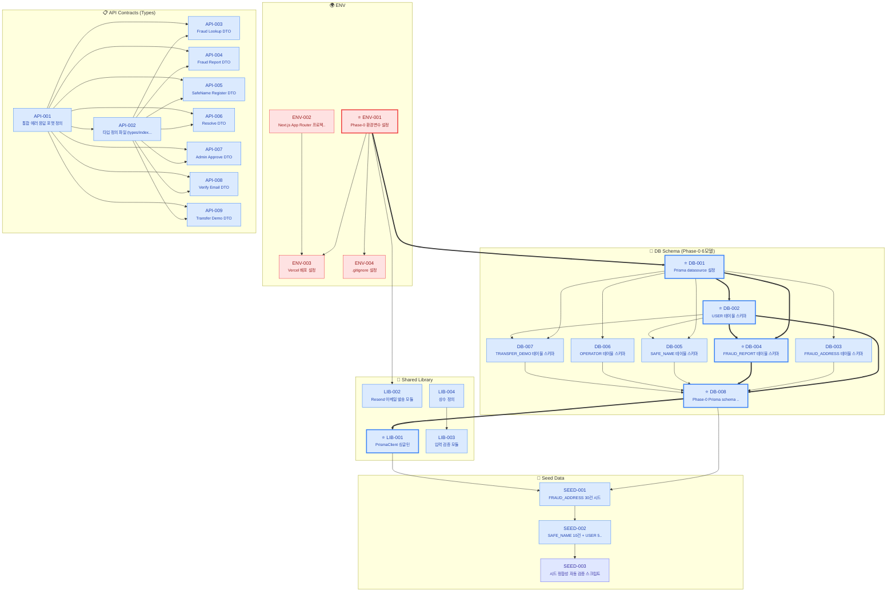

# Phase-0 (MVP) 개발 의존성 상세 다이어그램 v0.2

**Source:** SRS-001 v0.8 + v0.8.1 / 4-6.ISSUES_Qu_V0_6_opus47.md / 1-2.TASKS_LIST_v0_2_opus47.md  
**작성:** Claude opus-4-7  
**작성일:** 2026-05-16  
**버전:** Dependency Graph v0.2  
**스코프:** **Phase-0 (MVP) 90건 태스크**의 개별 노드 단위 의존성 시각화

---

## 📋 문서 개요

본 문서는 Fraud Shield Phase-0 (MVP) 출시를 위한 **90건 태스크의 의존성을 개별 노드 단위로 표현**한 상세 다이어그램입니다. 개발팀의 작업 순서 결정, 병렬 작업 가능 영역 식별, Critical Path 관리, 리스크 분석에 활용됩니다.

### 본 문서로 답할 수 있는 질문

| 질문 | 답변 위치 |
|---|---|
| "어떤 태스크부터 시작해야 하는가?" | §3 Foundation Layer 다이어그램 + 진입점 5건 |
| "어떤 태스크가 지연되면 전체 일정에 영향이 큰가?" | §4 Critical Path 11단계 |
| "병렬 작업이 가능한 영역은?" | §5 Layer별 매트릭스 |
| "한 태스크가 영향을 미치는 후행 태스크는 몇 건인가?" | §6 영향력 Top 15 |
| "MVP 출시 직전 어떤 테스트/NFR을 통과해야 하는가?" | §7 Tests + NFR Gate 다이어그램 |
| "현재 의존성 그래프가 무결한가?" | §8 그래프 무결성 검증 |

---

## 📊 Phase-0 그래프 핵심 통계

| 지표 | 값 | 의미 |
|---|---|---|
| **총 노드 (태스크)** | **90** | Phase-0 90건 100% 커버 |
| **총 엣지 (의존성)** | **173** | 양방향 일관성 보장 (불일치 0건) |
| **평균 엣지/노드** | 1.92 | 보통 수준 (10 이상이면 과결합) |
| **레이어 수 (토폴로지 깊이)** | **11** | Critical Path 단계 수와 일치 |
| **진입점** (Depends on None) | 5건 | ENV-001/002, API-001, LIB-004, NFR-005 |
| **종착점** (Blocks None) | 29건 | 주로 Tests/NFR 영역 (MVP 출시 Gate) |
| **순환 의존성 (사이클)** | **0건** | DAG (방향성 비순환 그래프) ✓ |
| **외부 Phase-1+ 의존성** | 0건 | Phase-0이 완전히 자급자족 ✓ |

### 카테고리별 분포

| 카테고리 | 건수 | 비중 | 의미 |
|---|---|---|---|
| 🔵 Foundation | 24 | 26.7% | DB/API/LIB/SEED/ENV (인프라) |
| 🟡 Command (CMD) | 13 | 14.4% | 쓰기 작업 (POST/PUT 핸들러) |
| 🟢 Query (QRY) | 7 | 7.8% | 읽기 작업 (GET 핸들러) |
| 🌸 Frontend (FE) | 10 | 11.1% | UI 컴포넌트 (Next.js + shadcn) |
| 🟣 Test | 23 | 25.6% | 단위 + 시드 + 수동 테스트 |
| 🔴 NFR | 11 | 12.2% | Phase-0 NFR (성능/보안/비용/가용성) |
| ⚪ Other | 2 | 2.2% | MW-001 등 |

### 우선순위별 분포

| Priority | 건수 | 비중 |
|---|---|---|
| 🔴 critical | 38 | 42.2% |
| 🟠 high | 47 | 52.2% |
| 🟡 medium | 4 | 4.4% |
| 🟢 low | 1 | 1.1% |

---

## 🎨 다이어그램 범례

### 노드 색상 (카테고리)
- 🔵 **파란색**: Foundation (DB/API/LIB/SEED/ENV)
- 🟡 **노란색**: Command (쓰기)
- 🟢 **녹색**: Query (읽기)
- 🌸 **분홍색**: Frontend (UI)
- 🟣 **보라색**: Test
- 🔴 **빨간색**: NFR (Phase-0 Gate)
- ⚪ **회색**: Other (Middleware 등)

### 화살표
- `-->` (얇은 화살표): 일반 의존성
- `==>` (굵은 화살표): **Critical Path 의존성** (가장 긴 경로)

### 노드 마커
- ⭐ **별표**: Critical Path 노드 (11단계 핵심 경로)


---

# §1. 전체 다이어그램 (Phase-0 90건 + 173 엣지)

Phase-0 전체 의존성 그래프입니다. 90개 노드와 173개 엣지가 11개 레이어로 정렬되어 있습니다. **렌더링이 느릴 수 있으므로 작업 시에는 §3~§4의 도메인별 분할 다이어그램을 권장**합니다.

```mermaid
%%{init: {'flowchart': {'curve': 'basis', 'htmlLabels': true, 'nodeSpacing': 30, 'rankSpacing': 60}, 'theme': 'default'}}%%
graph TD
  subgraph Foundation_Infra["🏗️ Foundation — 환경/인프라"]
    ENV-001["⭐ ENV-001<br/><small>Phase-0 환경변수 설정</small>"]
    ENV-002["ENV-002<br/><small>Next.js App Router 프로젝트 초...</small>"]
    ENV-003["ENV-003<br/><small>Vercel 배포 설정</small>"]
    ENV-004["ENV-004<br/><small>.gitignore 설정</small>"]
  end
  subgraph Foundation_DB["💾 Foundation — DB Schema"]
    DB-001["⭐ DB-001<br/><small>Prisma datasource 설정</small>"]
    DB-002["⭐ DB-002<br/><small>USER 테이블 스키마</small>"]
    DB-003["DB-003<br/><small>FRAUD_ADDRESS 테이블 스키마</small>"]
    DB-004["⭐ DB-004<br/><small>FRAUD_REPORT 테이블 스키마</small>"]
    DB-005["DB-005<br/><small>SAFE_NAME 테이블 스키마</small>"]
    DB-006["DB-006<br/><small>OPERATOR 테이블 스키마</small>"]
    DB-007["DB-007<br/><small>TRANSFER_DEMO 테이블 스키마</small>"]
    DB-008["⭐ DB-008<br/><small>Phase-0 Prisma schema 통합 ...</small>"]
  end
  subgraph Foundation_API["📋 Foundation — API Contracts"]
    API-001["API-001<br/><small>통합 에러 응답 포맷 정의</small>"]
    API-002["API-002<br/><small>타입 정의 파일 (types/index.ts)</small>"]
    API-003["API-003<br/><small>Fraud Lookup DTO</small>"]
    API-004["API-004<br/><small>Fraud Report DTO</small>"]
    API-005["API-005<br/><small>SafeName Register DTO</small>"]
    API-006["API-006<br/><small>Resolve DTO</small>"]
    API-007["API-007<br/><small>Admin Approve DTO</small>"]
    API-008["API-008<br/><small>Verify Email DTO</small>"]
    API-009["API-009<br/><small>Transfer Demo DTO</small>"]
  end
  subgraph Foundation_Lib["🔧 Foundation — Shared Lib"]
    LIB-001["⭐ LIB-001<br/><small>PrismaClient 싱글턴</small>"]
    LIB-002["LIB-002<br/><small>Resend 이메일 발송 모듈</small>"]
    LIB-003["LIB-003<br/><small>입력 검증 모듈</small>"]
    LIB-004["LIB-004<br/><small>상수 정의</small>"]
  end
  subgraph Foundation_Seed["🌱 Foundation — Seed Data"]
    SEED-001["SEED-001<br/><small>FRAUD_ADDRESS 30건 시드</small>"]
    SEED-002["SEED-002<br/><small>SAFE_NAME 10건 + USER 5건 +...</small>"]
    SEED-003["SEED-003<br/><small>시드 정합성 자동 검증 스크립트</small>"]
  end
  subgraph Auth["🔐 Auth"]
    MW-001["MW-001<br/><small>middleware.ts Admin 인증 가드</small>"]
    CMD-AUTH-001["⭐ CMD-AUTH-001<br/><small>이메일 인증 코드 발송</small>"]
    CMD-AUTH-002["⭐ CMD-AUTH-002<br/><small>이메일 인증 코드 확인 + USER 생성/갱신</small>"]
    FE-AUTH-001["⭐ FE-AUTH-001<br/><small>/auth/verify 이메일 인증 페이지</small>"]
    FE-AUTH-002["FE-AUTH-002<br/><small>/auth/admin-login 관리자 로그인...</small>"]
  end
  subgraph Fraud_Lookup["🔍 Fraud Lookup"]
    QRY-FRAUD-001["QRY-FRAUD-001<br/><small>사기 주소 조회 (FRAUD_ADDRESS 매...</small>"]
    QRY-FRAUD-002["QRY-FRAUD-002<br/><small>주소 형식 유효성 검증</small>"]
    QRY-FRAUD-003["QRY-FRAUD-003<br/><small>source_type 폴백 표시</small>"]
    FE-FRAUD-001["FE-FRAUD-001<br/><small>/(public)/fraud-lookup 조회...</small>"]
  end
  subgraph Fraud_Report["📝 Fraud Report"]
    CMD-FRAUD-001["CMD-FRAUD-001<br/><small>사기 주소 신고 접수</small>"]
    CMD-FRAUD-002["CMD-FRAUD-002<br/><small>동일 주소 중복 신고 처리</small>"]
    CMD-FRAUD-003["CMD-FRAUD-003<br/><small>신고 접수 Email 발송</small>"]
    CMD-FRAUD-004["CMD-FRAUD-004<br/><small>신고 제한 유저 검증</small>"]
    FE-FRAUD-002["⭐ FE-FRAUD-002<br/><small>/(public)/fraud-lookup 신고...</small>"]
  end
  subgraph SafeName["🏷️ Safe-Name (등록 + 리졸브)"]
    CMD-SN-001["CMD-SN-001<br/><small>Safe-Name 등록 (이름 규칙·중복·예약...</small>"]
    CMD-SN-002["CMD-SN-002<br/><small>지갑 주소 형식 검증</small>"]
    FE-SN-001["FE-SN-001<br/><small>/(public)/safe-name 등록 탭 ...</small>"]
    QRY-SN-001["QRY-SN-001<br/><small>Safe-Name 리졸브 (이름 → 주소)</small>"]
    QRY-SN-002["QRY-SN-002<br/><small>리졸브 주소 사기 DB 교차 조회</small>"]
    QRY-SN-003["QRY-SN-003<br/><small>미등록·만료 이름 안내</small>"]
    FE-SN-002["FE-SN-002<br/><small>/(public)/safe-name 리졸브 탭...</small>"]
  end
  subgraph Admin["👮 Admin Approval"]
    QRY-ADMIN-001["QRY-ADMIN-001<br/><small>대기 신고 목록 조회</small>"]
    CMD-ADMIN-001["CMD-ADMIN-001<br/><small>신고 승인 + FRAUD_ADDRESS 반영</small>"]
    CMD-ADMIN-002["CMD-ADMIN-002<br/><small>신고 거부 + reviewer_notes 저장</small>"]
    CMD-ADMIN-003["CMD-ADMIN-003<br/><small>승인/거부 결과 Email 통지</small>"]
    FE-ADMIN-001["FE-ADMIN-001<br/><small>/(admin)/approval 신고 승인 대...</small>"]
  end
  subgraph Transfer["💸 Transfer Demo"]
    CMD-TX-001["CMD-TX-001<br/><small>데모 이체 (리졸브 + 미등록 처리)</small>"]
    CMD-TX-002["CMD-TX-002<br/><small>데모 이체 (사기 DB 교차 + 차단)</small>"]
    CMD-TX-003["CMD-TX-003<br/><small>데모 이체 (정상 완료)</small>"]
    CMD-TX-004["CMD-TX-004<br/><small>데모 이체 결과 Email 통지</small>"]
    FE-TX-001["FE-TX-001<br/><small>/(public)/safe-name 이체 탭 ...</small>"]
  end
  subgraph Layout["🎨 Common Layout"]
    FE-LAYOUT-001["FE-LAYOUT-001<br/><small>공통 레이아웃 (layout.tsx + glo...</small>"]
    FE-LAYOUT-002["FE-LAYOUT-002<br/><small>shadcn/ui 컴포넌트 초기 설치</small>"]
  end
  subgraph Tests["✅ Tests"]
    TEST-001["TEST-001<br/><small>사기 조회 단위 테스트</small>"]
    TEST-002["TEST-002<br/><small>source_type 폴백 테스트</small>"]
    TEST-003["TEST-003<br/><small>사기 신고 단위 테스트</small>"]
    TEST-004["TEST-004<br/><small>중복 신고 테스트</small>"]
    TEST-005["TEST-005<br/><small>접수 Email 발송 테스트</small>"]
    TEST-006["TEST-006<br/><small>Safe-Name 등록 단위 테스트</small>"]
    TEST-007["TEST-007<br/><small>이름 규칙 검증 테스트</small>"]
    TEST-008["TEST-008<br/><small>리졸브 단위 테스트</small>"]
    TEST-009["TEST-009<br/><small>사기 DB 교차 테스트</small>"]
    TEST-010["TEST-010<br/><small>미등록/만료 이름 테스트</small>"]
    TEST-011["TEST-011<br/><small>승인 대시보드 접근 테스트</small>"]
    TEST-012["TEST-012<br/><small>승인/거부 GWT 테스트</small>"]
    TEST-013["TEST-013<br/><small>결과 통지 Email 테스트</small>"]
    TEST-014["TEST-014<br/><small>이메일 인증 발송 테스트</small>"]
    TEST-015["TEST-015<br/><small>코드 확인 GWT 테스트</small>"]
    TEST-016["TEST-016<br/><small>데모 이체 기본 테스트</small>"]
    TEST-017["TEST-017<br/><small>이체 차단 테스트</small>"]
    TEST-018["TEST-018<br/><small>이체 완료/미등록 테스트</small>"]
    TEST-019["TEST-019<br/><small>이체 Email 통지 테스트</small>"]
    TEST-020["TEST-020<br/><small>Admin 인증 가드 테스트</small>"]
    TEST-021["TEST-021<br/><small>시드 정합성 테스트</small>"]
    TEST-022["⭐ TEST-022<br/><small>Phase-0 수동 테스트 19개 체크리스트 ...</small>"]
  end
  subgraph NFR["⚙️ NFR (Phase-0 Gate)"]
    NFR-001["NFR-001<br/><small>DB 인덱스 점검 (사기 조회·리졸브 성능)</small>"]
    NFR-002["NFR-002<br/><small>HTTPS 강제 확인</small>"]
    NFR-003["NFR-003<br/><small>Admin 미인증 접근 차단 100%</small>"]
    NFR-004["NFR-004<br/><small>월 인프라 비용 ≤ $22 (Gate)</small>"]
    NFR-005["NFR-005<br/><small>API 로그 기록</small>"]
    NFR-006["NFR-006<br/><small>시드 수용 테스트</small>"]
    NFR-007["NFR-007<br/><small>가용성 ≥ 99.0% 모니터링</small>"]
  end

  %% Dependencies (depends on)
  ENV-001 ==> DB-001
  DB-001 ==> DB-002
  DB-001 --> DB-003
  DB-001 ==> DB-004
  DB-002 ==> DB-004
  DB-001 --> DB-005
  DB-002 --> DB-005
  DB-001 --> DB-006
  DB-001 --> DB-007
  DB-002 --> DB-007
  DB-002 ==> DB-008
  DB-003 --> DB-008
  DB-004 ==> DB-008
  DB-005 --> DB-008
  DB-006 --> DB-008
  DB-007 --> DB-008
  API-001 --> API-002
  API-001 --> API-003
  API-002 --> API-003
  API-001 --> API-004
  API-002 --> API-004
  API-001 --> API-005
  API-002 --> API-005
  API-001 --> API-006
  API-002 --> API-006
  API-001 --> API-007
  API-002 --> API-007
  API-001 --> API-008
  API-002 --> API-008
  API-001 --> API-009
  API-002 --> API-009
  DB-008 ==> LIB-001
  ENV-001 --> LIB-002
  LIB-004 --> LIB-003
  DB-008 --> SEED-001
  LIB-001 --> SEED-001
  SEED-001 --> SEED-002
  SEED-002 --> SEED-003
  ENV-001 --> ENV-003
  ENV-002 --> ENV-003
  ENV-001 --> ENV-004
  ENV-001 --> MW-001
  API-008 --> CMD-AUTH-001
  DB-008 ==> CMD-AUTH-001
  LIB-001 ==> CMD-AUTH-001
  LIB-002 --> CMD-AUTH-001
  LIB-003 --> CMD-AUTH-001
  CMD-AUTH-001 ==> CMD-AUTH-002
  API-008 --> FE-AUTH-001
  CMD-AUTH-001 ==> FE-AUTH-001
  CMD-AUTH-002 ==> FE-AUTH-001
  ENV-002 --> FE-AUTH-001
  FE-LAYOUT-002 --> FE-AUTH-001
  ENV-002 --> FE-AUTH-002
  MW-001 --> FE-AUTH-002
  API-003 --> QRY-FRAUD-001
  DB-008 --> QRY-FRAUD-001
  LIB-001 --> QRY-FRAUD-001
  LIB-003 --> QRY-FRAUD-002
  QRY-FRAUD-001 --> QRY-FRAUD-002
  QRY-FRAUD-001 --> QRY-FRAUD-003
  API-003 --> FE-FRAUD-001
  ENV-002 --> FE-FRAUD-001
  FE-LAYOUT-001 --> FE-FRAUD-001
  FE-LAYOUT-002 --> FE-FRAUD-001
  QRY-FRAUD-001 --> FE-FRAUD-001
  API-004 --> CMD-FRAUD-001
  CMD-AUTH-002 --> CMD-FRAUD-001
  DB-008 --> CMD-FRAUD-001
  LIB-001 --> CMD-FRAUD-001
  LIB-002 --> CMD-FRAUD-001
  LIB-003 --> CMD-FRAUD-001
  CMD-FRAUD-001 --> CMD-FRAUD-002
  CMD-FRAUD-001 --> CMD-FRAUD-003
  LIB-002 --> CMD-FRAUD-003
  CMD-FRAUD-001 --> CMD-FRAUD-004
  API-004 --> FE-FRAUD-002
  CMD-FRAUD-001 --> FE-FRAUD-002
  ENV-002 --> FE-FRAUD-002
  FE-AUTH-001 ==> FE-FRAUD-002
  FE-LAYOUT-002 --> FE-FRAUD-002
  API-005 --> CMD-SN-001
  CMD-AUTH-002 --> CMD-SN-001
  DB-008 --> CMD-SN-001
  LIB-001 --> CMD-SN-001
  LIB-003 --> CMD-SN-001
  CMD-SN-001 --> CMD-SN-002
  LIB-003 --> CMD-SN-002
  API-005 --> FE-SN-001
  CMD-SN-001 --> FE-SN-001
  ENV-002 --> FE-SN-001
  FE-LAYOUT-001 --> FE-SN-001
  API-006 --> QRY-SN-001
  DB-008 --> QRY-SN-001
  LIB-001 --> QRY-SN-001
  QRY-SN-001 --> QRY-SN-002
  QRY-SN-001 --> QRY-SN-003
  API-006 --> FE-SN-002
  ENV-002 --> FE-SN-002
  FE-LAYOUT-001 --> FE-SN-002
  QRY-SN-001 --> FE-SN-002
  DB-008 --> QRY-ADMIN-001
  LIB-001 --> QRY-ADMIN-001
  MW-001 --> QRY-ADMIN-001
  API-007 --> CMD-ADMIN-001
  DB-008 --> CMD-ADMIN-001
  LIB-001 --> CMD-ADMIN-001
  MW-001 --> CMD-ADMIN-001
  CMD-ADMIN-001 --> CMD-ADMIN-002
  CMD-ADMIN-001 --> CMD-ADMIN-003
  LIB-002 --> CMD-ADMIN-003
  API-007 --> FE-ADMIN-001
  CMD-ADMIN-001 --> FE-ADMIN-001
  ENV-002 --> FE-ADMIN-001
  FE-AUTH-002 --> FE-ADMIN-001
  FE-LAYOUT-001 --> FE-ADMIN-001
  MW-001 --> FE-ADMIN-001
  QRY-ADMIN-001 --> FE-ADMIN-001
  API-009 --> CMD-TX-001
  CMD-AUTH-002 --> CMD-TX-001
  DB-008 --> CMD-TX-001
  LIB-001 --> CMD-TX-001
  CMD-TX-001 --> CMD-TX-002
  CMD-TX-001 --> CMD-TX-003
  CMD-TX-001 --> CMD-TX-004
  LIB-002 --> CMD-TX-004
  API-009 --> FE-TX-001
  CMD-TX-001 --> FE-TX-001
  ENV-002 --> FE-TX-001
  FE-AUTH-001 --> FE-TX-001
  FE-LAYOUT-001 --> FE-TX-001
  ENV-002 --> FE-LAYOUT-001
  ENV-002 --> FE-LAYOUT-002
  QRY-FRAUD-001 --> TEST-001
  QRY-FRAUD-002 --> TEST-001
  QRY-FRAUD-003 --> TEST-002
  CMD-FRAUD-001 --> TEST-003
  CMD-FRAUD-004 --> TEST-003
  CMD-FRAUD-002 --> TEST-004
  CMD-FRAUD-003 --> TEST-005
  CMD-SN-001 --> TEST-006
  CMD-SN-002 --> TEST-006
  CMD-SN-001 --> TEST-007
  LIB-003 --> TEST-007
  QRY-SN-001 --> TEST-008
  QRY-SN-002 --> TEST-009
  QRY-SN-003 --> TEST-010
  QRY-ADMIN-001 --> TEST-011
  CMD-ADMIN-001 --> TEST-012
  CMD-ADMIN-002 --> TEST-012
  CMD-ADMIN-003 --> TEST-013
  CMD-AUTH-001 --> TEST-014
  CMD-AUTH-002 --> TEST-015
  CMD-TX-001 --> TEST-016
  CMD-TX-002 --> TEST-017
  CMD-TX-003 --> TEST-018
  CMD-TX-004 --> TEST-019
  MW-001 --> TEST-020
  SEED-003 --> TEST-021
  FE-ADMIN-001 --> TEST-022
  FE-FRAUD-001 --> TEST-022
  FE-FRAUD-002 ==> TEST-022
  FE-SN-001 --> TEST-022
  FE-SN-002 --> TEST-022
  FE-TX-001 --> TEST-022
  DB-003 --> NFR-001
  DB-008 --> NFR-001
  ENV-003 --> NFR-002
  MW-001 --> NFR-003
  TEST-020 --> NFR-003
  ENV-003 --> NFR-004
  SEED-003 --> NFR-006
  ENV-003 --> NFR-007

  %% Category styles
  style DB-001 fill:#dbeafe,stroke:#3b82f6,stroke-width:1px,color:#1e40af
  style DB-002 fill:#dbeafe,stroke:#3b82f6,stroke-width:1px,color:#1e40af
  style DB-003 fill:#dbeafe,stroke:#3b82f6,stroke-width:1px,color:#1e40af
  style DB-004 fill:#dbeafe,stroke:#3b82f6,stroke-width:1px,color:#1e40af
  style DB-005 fill:#dbeafe,stroke:#3b82f6,stroke-width:1px,color:#1e40af
  style DB-006 fill:#dbeafe,stroke:#3b82f6,stroke-width:1px,color:#1e40af
  style DB-007 fill:#dbeafe,stroke:#3b82f6,stroke-width:1px,color:#1e40af
  style DB-008 fill:#dbeafe,stroke:#3b82f6,stroke-width:1px,color:#1e40af
  style API-001 fill:#dbeafe,stroke:#3b82f6,stroke-width:1px,color:#1e40af
  style API-002 fill:#dbeafe,stroke:#3b82f6,stroke-width:1px,color:#1e40af
  style API-003 fill:#dbeafe,stroke:#3b82f6,stroke-width:1px,color:#1e40af
  style API-004 fill:#dbeafe,stroke:#3b82f6,stroke-width:1px,color:#1e40af
  style API-005 fill:#dbeafe,stroke:#3b82f6,stroke-width:1px,color:#1e40af
  style API-006 fill:#dbeafe,stroke:#3b82f6,stroke-width:1px,color:#1e40af
  style API-007 fill:#dbeafe,stroke:#3b82f6,stroke-width:1px,color:#1e40af
  style API-008 fill:#dbeafe,stroke:#3b82f6,stroke-width:1px,color:#1e40af
  style API-009 fill:#dbeafe,stroke:#3b82f6,stroke-width:1px,color:#1e40af
  style LIB-001 fill:#dbeafe,stroke:#3b82f6,stroke-width:1px,color:#1e40af
  style LIB-002 fill:#dbeafe,stroke:#3b82f6,stroke-width:1px,color:#1e40af
  style LIB-003 fill:#dbeafe,stroke:#3b82f6,stroke-width:1px,color:#1e40af
  style LIB-004 fill:#dbeafe,stroke:#3b82f6,stroke-width:1px,color:#1e40af
  style SEED-001 fill:#dbeafe,stroke:#3b82f6,stroke-width:1px,color:#1e40af
  style SEED-002 fill:#dbeafe,stroke:#3b82f6,stroke-width:1px,color:#1e40af
  style SEED-003 fill:#e0e7ff,stroke:#6366f1,stroke-width:1px,color:#3730a3
  style ENV-001 fill:#fee2e2,stroke:#ef4444,stroke-width:1px,color:#991b1b
  style ENV-002 fill:#fee2e2,stroke:#ef4444,stroke-width:1px,color:#991b1b
  style ENV-003 fill:#fee2e2,stroke:#ef4444,stroke-width:1px,color:#991b1b
  style ENV-004 fill:#fee2e2,stroke:#ef4444,stroke-width:1px,color:#991b1b
  style MW-001 fill:#dbeafe,stroke:#3b82f6,stroke-width:1px,color:#1e40af
  style CMD-AUTH-001 fill:#f3f4f6,stroke:#6b7280,stroke-width:1px,color:#374151
  style CMD-AUTH-002 fill:#f3f4f6,stroke:#6b7280,stroke-width:1px,color:#374151
  style FE-AUTH-001 fill:#fce7f3,stroke:#ec4899,stroke-width:1px,color:#9f1239
  style FE-AUTH-002 fill:#fce7f3,stroke:#ec4899,stroke-width:1px,color:#9f1239
  style QRY-FRAUD-001 fill:#d1fae5,stroke:#10b981,stroke-width:1px,color:#065f46
  style QRY-FRAUD-002 fill:#d1fae5,stroke:#10b981,stroke-width:1px,color:#065f46
  style QRY-FRAUD-003 fill:#d1fae5,stroke:#10b981,stroke-width:1px,color:#065f46
  style FE-FRAUD-001 fill:#fce7f3,stroke:#ec4899,stroke-width:1px,color:#9f1239
  style CMD-FRAUD-001 fill:#fef3c7,stroke:#f59e0b,stroke-width:1px,color:#92400e
  style CMD-FRAUD-002 fill:#fef3c7,stroke:#f59e0b,stroke-width:1px,color:#92400e
  style CMD-FRAUD-003 fill:#fef3c7,stroke:#f59e0b,stroke-width:1px,color:#92400e
  style CMD-FRAUD-004 fill:#fef3c7,stroke:#f59e0b,stroke-width:1px,color:#92400e
  style FE-FRAUD-002 fill:#fce7f3,stroke:#ec4899,stroke-width:1px,color:#9f1239
  style CMD-SN-001 fill:#fef3c7,stroke:#f59e0b,stroke-width:1px,color:#92400e
  style CMD-SN-002 fill:#fef3c7,stroke:#f59e0b,stroke-width:1px,color:#92400e
  style FE-SN-001 fill:#fce7f3,stroke:#ec4899,stroke-width:1px,color:#9f1239
  style QRY-SN-001 fill:#d1fae5,stroke:#10b981,stroke-width:1px,color:#065f46
  style QRY-SN-002 fill:#d1fae5,stroke:#10b981,stroke-width:1px,color:#065f46
  style QRY-SN-003 fill:#d1fae5,stroke:#10b981,stroke-width:1px,color:#065f46
  style FE-SN-002 fill:#fce7f3,stroke:#ec4899,stroke-width:1px,color:#9f1239
  style QRY-ADMIN-001 fill:#d1fae5,stroke:#10b981,stroke-width:1px,color:#065f46
  style CMD-ADMIN-001 fill:#fef3c7,stroke:#f59e0b,stroke-width:1px,color:#92400e
  style CMD-ADMIN-002 fill:#fef3c7,stroke:#f59e0b,stroke-width:1px,color:#92400e
  style CMD-ADMIN-003 fill:#fef3c7,stroke:#f59e0b,stroke-width:1px,color:#92400e
  style FE-ADMIN-001 fill:#fce7f3,stroke:#ec4899,stroke-width:1px,color:#9f1239
  style CMD-TX-001 fill:#fef3c7,stroke:#f59e0b,stroke-width:1px,color:#92400e
  style CMD-TX-002 fill:#fef3c7,stroke:#f59e0b,stroke-width:1px,color:#92400e
  style CMD-TX-003 fill:#fef3c7,stroke:#f59e0b,stroke-width:1px,color:#92400e
  style CMD-TX-004 fill:#fef3c7,stroke:#f59e0b,stroke-width:1px,color:#92400e
  style FE-TX-001 fill:#fce7f3,stroke:#ec4899,stroke-width:1px,color:#9f1239
  style FE-LAYOUT-001 fill:#fce7f3,stroke:#ec4899,stroke-width:1px,color:#9f1239
  style FE-LAYOUT-002 fill:#fce7f3,stroke:#ec4899,stroke-width:1px,color:#9f1239
  style TEST-001 fill:#e0e7ff,stroke:#6366f1,stroke-width:1px,color:#3730a3
  style TEST-002 fill:#e0e7ff,stroke:#6366f1,stroke-width:1px,color:#3730a3
  style TEST-003 fill:#e0e7ff,stroke:#6366f1,stroke-width:1px,color:#3730a3
  style TEST-004 fill:#e0e7ff,stroke:#6366f1,stroke-width:1px,color:#3730a3
  style TEST-005 fill:#e0e7ff,stroke:#6366f1,stroke-width:1px,color:#3730a3
  style TEST-006 fill:#e0e7ff,stroke:#6366f1,stroke-width:1px,color:#3730a3
  style TEST-007 fill:#e0e7ff,stroke:#6366f1,stroke-width:1px,color:#3730a3
  style TEST-008 fill:#e0e7ff,stroke:#6366f1,stroke-width:1px,color:#3730a3
  style TEST-009 fill:#e0e7ff,stroke:#6366f1,stroke-width:1px,color:#3730a3
  style TEST-010 fill:#e0e7ff,stroke:#6366f1,stroke-width:1px,color:#3730a3
  style TEST-011 fill:#e0e7ff,stroke:#6366f1,stroke-width:1px,color:#3730a3
  style TEST-012 fill:#e0e7ff,stroke:#6366f1,stroke-width:1px,color:#3730a3
  style TEST-013 fill:#e0e7ff,stroke:#6366f1,stroke-width:1px,color:#3730a3
  style TEST-014 fill:#e0e7ff,stroke:#6366f1,stroke-width:1px,color:#3730a3
  style TEST-015 fill:#e0e7ff,stroke:#6366f1,stroke-width:1px,color:#3730a3
  style TEST-016 fill:#e0e7ff,stroke:#6366f1,stroke-width:1px,color:#3730a3
  style TEST-017 fill:#e0e7ff,stroke:#6366f1,stroke-width:1px,color:#3730a3
  style TEST-018 fill:#e0e7ff,stroke:#6366f1,stroke-width:1px,color:#3730a3
  style TEST-019 fill:#e0e7ff,stroke:#6366f1,stroke-width:1px,color:#3730a3
  style TEST-020 fill:#e0e7ff,stroke:#6366f1,stroke-width:1px,color:#3730a3
  style TEST-021 fill:#e0e7ff,stroke:#6366f1,stroke-width:1px,color:#3730a3
  style TEST-022 fill:#e0e7ff,stroke:#6366f1,stroke-width:1px,color:#3730a3
  style NFR-001 fill:#fee2e2,stroke:#ef4444,stroke-width:1px,color:#991b1b
  style NFR-002 fill:#fee2e2,stroke:#ef4444,stroke-width:1px,color:#991b1b
  style NFR-003 fill:#fee2e2,stroke:#ef4444,stroke-width:1px,color:#991b1b
  style NFR-004 fill:#fee2e2,stroke:#ef4444,stroke-width:1px,color:#991b1b
  style NFR-005 fill:#fee2e2,stroke:#ef4444,stroke-width:1px,color:#991b1b
  style NFR-006 fill:#fee2e2,stroke:#ef4444,stroke-width:1px,color:#991b1b
  style NFR-007 fill:#fee2e2,stroke:#ef4444,stroke-width:1px,color:#991b1b

  %% Critical Path 강조
  style DB-001 stroke-width:3px,stroke-dasharray:0
  style DB-004 stroke-width:3px,stroke-dasharray:0
  style ENV-001 stroke-width:3px,stroke-dasharray:0
  style LIB-001 stroke-width:3px,stroke-dasharray:0
  style CMD-AUTH-001 stroke-width:3px,stroke-dasharray:0
  style FE-AUTH-001 stroke-width:3px,stroke-dasharray:0
  style DB-002 stroke-width:3px,stroke-dasharray:0
  style FE-FRAUD-002 stroke-width:3px,stroke-dasharray:0
  style DB-008 stroke-width:3px,stroke-dasharray:0
  style CMD-AUTH-002 stroke-width:3px,stroke-dasharray:0
  style TEST-022 stroke-width:3px,stroke-dasharray:0
```
---

# §2. 도메인별 분할 다이어그램

전체 그래프는 복잡도가 높아 가독성이 떨어집니다. 다음 3개 도메인으로 분할하여 시각화합니다.

## §2-1. Foundation Layer (28건) — 인프라 기반

DB 스키마, API Spec, Shared Lib, Seed Data, 환경 설정. **모든 Phase-0 Features의 선행 조건**.


**핵심 흐름:**
1. **ENV-001/002** (환경) → **DB-001** (Prisma datasource) → **DB-002~007** (6모델) → **DB-008** (통합 마이그레이션)
2. **API-001** (에러 포맷) → **API-002** (타입 정의) → **API-003~009** (각 엔드포인트 DTO)
3. **DB-008** + **ENV-001** → **LIB-001** (Prisma client) / **LIB-002** (Resend)
4. **LIB-004** (상수) → **LIB-003** (검증 모듈)
5. **DB-008** + **LIB-001** → **SEED-001~003** (시드 데이터)

**병렬 가능 영역:**
- API-001~009는 DB와 독립적으로 진행 가능 (TypeScript DTO만 작성)
- LIB-004 (상수 정의)는 진입점이므로 가장 먼저 작성 가능
- DB-002~007 6모델은 DB-001 완료 후 동시 작성 가능

---

## §2-2. Phase-0 Features (33건) — 7개 핵심 기능

이메일 인증 + 사기 조회 + 사기 신고 + Safe-Name (등록/리졸브) + Admin 승인 + Transfer 시뮬레이션 + 공통 Layout. **모든 기능은 Foundation Layer 완료 후 시작 가능**.

```mermaid
%%{init: {'flowchart': {'curve': 'basis', 'nodeSpacing': 25, 'rankSpacing': 50}}}%%
graph TD
  subgraph Layout["🎨 Layout"]
    FE-LAYOUT-001["FE-LAYOUT-001<br/><small>공통 레이아웃 (layout.tsx + ..</small>"]
    FE-LAYOUT-002["FE-LAYOUT-002<br/><small>shadcn/ui 컴포넌트 초기 설치</small>"]
  end
  subgraph Auth["🔐 Auth (이메일 인증 + Admin)"]
    MW-001["MW-001<br/><small>middleware.ts Admin 인증..</small>"]
    CMD-AUTH-001["⭐ CMD-AUTH-001<br/><small>이메일 인증 코드 발송</small>"]
    CMD-AUTH-002["⭐ CMD-AUTH-002<br/><small>이메일 인증 코드 확인 + USER 생성..</small>"]
    FE-AUTH-001["⭐ FE-AUTH-001<br/><small>/auth/verify 이메일 인증 페이..</small>"]
    FE-AUTH-002["FE-AUTH-002<br/><small>/auth/admin-login 관리자 ..</small>"]
  end
  subgraph FraudLookup["🔍 Fraud Lookup (P0-F1)"]
    QRY-FRAUD-001["QRY-FRAUD-001<br/><small>사기 주소 조회 (FRAUD_ADDRES..</small>"]
    QRY-FRAUD-002["QRY-FRAUD-002<br/><small>주소 형식 유효성 검증</small>"]
    QRY-FRAUD-003["QRY-FRAUD-003<br/><small>source_type 폴백 표시</small>"]
    FE-FRAUD-001["FE-FRAUD-001<br/><small>/(public)/fraud-lookup..</small>"]
  end
  subgraph FraudReport["📝 Fraud Report (P0-F2)"]
    CMD-FRAUD-001["CMD-FRAUD-001<br/><small>사기 주소 신고 접수</small>"]
    CMD-FRAUD-002["CMD-FRAUD-002<br/><small>동일 주소 중복 신고 처리</small>"]
    CMD-FRAUD-003["CMD-FRAUD-003<br/><small>신고 접수 Email 발송</small>"]
    CMD-FRAUD-004["CMD-FRAUD-004<br/><small>신고 제한 유저 검증</small>"]
    FE-FRAUD-002["⭐ FE-FRAUD-002<br/><small>/(public)/fraud-lookup..</small>"]
  end
  subgraph SN_Register["🏷️ Safe-Name Register (P0-F3)"]
    CMD-SN-001["CMD-SN-001<br/><small>Safe-Name 등록 (이름 규칙·중복..</small>"]
    CMD-SN-002["CMD-SN-002<br/><small>지갑 주소 형식 검증</small>"]
    FE-SN-001["FE-SN-001<br/><small>/(public)/safe-name 등록..</small>"]
  end
  subgraph SN_Resolve["🔎 Safe-Name Resolve (P0-F4)"]
    QRY-SN-001["QRY-SN-001<br/><small>Safe-Name 리졸브 (이름 → 주소..</small>"]
    QRY-SN-002["QRY-SN-002<br/><small>리졸브 주소 사기 DB 교차 조회</small>"]
    QRY-SN-003["QRY-SN-003<br/><small>미등록·만료 이름 안내</small>"]
    FE-SN-002["FE-SN-002<br/><small>/(public)/safe-name 리졸..</small>"]
  end
  subgraph Admin["👮 Admin Approval (P0-F5)"]
    QRY-ADMIN-001["QRY-ADMIN-001<br/><small>대기 신고 목록 조회</small>"]
    CMD-ADMIN-001["CMD-ADMIN-001<br/><small>신고 승인 + FRAUD_ADDRESS ..</small>"]
    CMD-ADMIN-002["CMD-ADMIN-002<br/><small>신고 거부 + reviewer_notes..</small>"]
    CMD-ADMIN-003["CMD-ADMIN-003<br/><small>승인/거부 결과 Email 통지</small>"]
    FE-ADMIN-001["FE-ADMIN-001<br/><small>/(admin)/approval 신고 승..</small>"]
  end
  subgraph Transfer["💸 Transfer Demo (P0-F7)"]
    CMD-TX-001["CMD-TX-001<br/><small>데모 이체 (리졸브 + 미등록 처리)</small>"]
    CMD-TX-002["CMD-TX-002<br/><small>데모 이체 (사기 DB 교차 + 차단)</small>"]
    CMD-TX-003["CMD-TX-003<br/><small>데모 이체 (정상 완료)</small>"]
    CMD-TX-004["CMD-TX-004<br/><small>데모 이체 결과 Email 통지</small>"]
    FE-TX-001["FE-TX-001<br/><small>/(public)/safe-name 이체..</small>"]
  end

  CMD-AUTH-001 ==> CMD-AUTH-002
  CMD-AUTH-001 ==> FE-AUTH-001
  CMD-AUTH-002 ==> FE-AUTH-001
  FE-LAYOUT-002 --> FE-AUTH-001
  MW-001 --> FE-AUTH-002
  QRY-FRAUD-001 --> QRY-FRAUD-002
  QRY-FRAUD-001 --> QRY-FRAUD-003
  FE-LAYOUT-001 --> FE-FRAUD-001
  FE-LAYOUT-002 --> FE-FRAUD-001
  QRY-FRAUD-001 --> FE-FRAUD-001
  CMD-AUTH-002 --> CMD-FRAUD-001
  CMD-FRAUD-001 --> CMD-FRAUD-002
  CMD-FRAUD-001 --> CMD-FRAUD-003
  CMD-FRAUD-001 --> CMD-FRAUD-004
  CMD-FRAUD-001 --> FE-FRAUD-002
  FE-AUTH-001 ==> FE-FRAUD-002
  FE-LAYOUT-002 --> FE-FRAUD-002
  CMD-AUTH-002 --> CMD-SN-001
  CMD-SN-001 --> CMD-SN-002
  CMD-SN-001 --> FE-SN-001
  FE-LAYOUT-001 --> FE-SN-001
  QRY-SN-001 --> QRY-SN-002
  QRY-SN-001 --> QRY-SN-003
  FE-LAYOUT-001 --> FE-SN-002
  QRY-SN-001 --> FE-SN-002
  MW-001 --> QRY-ADMIN-001
  MW-001 --> CMD-ADMIN-001
  CMD-ADMIN-001 --> CMD-ADMIN-002
  CMD-ADMIN-001 --> CMD-ADMIN-003
  CMD-ADMIN-001 --> FE-ADMIN-001
  FE-AUTH-002 --> FE-ADMIN-001
  FE-LAYOUT-001 --> FE-ADMIN-001
  MW-001 --> FE-ADMIN-001
  QRY-ADMIN-001 --> FE-ADMIN-001
  CMD-AUTH-002 --> CMD-TX-001
  CMD-TX-001 --> CMD-TX-002
  CMD-TX-001 --> CMD-TX-003
  CMD-TX-001 --> CMD-TX-004
  CMD-TX-001 --> FE-TX-001
  FE-AUTH-001 --> FE-TX-001
  FE-LAYOUT-001 --> FE-TX-001

  style MW-001 fill:#dbeafe,stroke:#3b82f6,stroke-width:1px,color:#1e40af
  style CMD-AUTH-001 fill:#f3f4f6,stroke:#6b7280,stroke-width:1px,color:#374151
  style CMD-AUTH-002 fill:#f3f4f6,stroke:#6b7280,stroke-width:1px,color:#374151
  style FE-AUTH-001 fill:#fce7f3,stroke:#ec4899,stroke-width:1px,color:#9f1239
  style FE-AUTH-002 fill:#fce7f3,stroke:#ec4899,stroke-width:1px,color:#9f1239
  style QRY-FRAUD-001 fill:#d1fae5,stroke:#10b981,stroke-width:1px,color:#065f46
  style QRY-FRAUD-002 fill:#d1fae5,stroke:#10b981,stroke-width:1px,color:#065f46
  style QRY-FRAUD-003 fill:#d1fae5,stroke:#10b981,stroke-width:1px,color:#065f46
  style FE-FRAUD-001 fill:#fce7f3,stroke:#ec4899,stroke-width:1px,color:#9f1239
  style CMD-FRAUD-001 fill:#fef3c7,stroke:#f59e0b,stroke-width:1px,color:#92400e
  style CMD-FRAUD-002 fill:#fef3c7,stroke:#f59e0b,stroke-width:1px,color:#92400e
  style CMD-FRAUD-003 fill:#fef3c7,stroke:#f59e0b,stroke-width:1px,color:#92400e
  style CMD-FRAUD-004 fill:#fef3c7,stroke:#f59e0b,stroke-width:1px,color:#92400e
  style FE-FRAUD-002 fill:#fce7f3,stroke:#ec4899,stroke-width:1px,color:#9f1239
  style CMD-SN-001 fill:#fef3c7,stroke:#f59e0b,stroke-width:1px,color:#92400e
  style CMD-SN-002 fill:#fef3c7,stroke:#f59e0b,stroke-width:1px,color:#92400e
  style FE-SN-001 fill:#fce7f3,stroke:#ec4899,stroke-width:1px,color:#9f1239
  style QRY-SN-001 fill:#d1fae5,stroke:#10b981,stroke-width:1px,color:#065f46
  style QRY-SN-002 fill:#d1fae5,stroke:#10b981,stroke-width:1px,color:#065f46
  style QRY-SN-003 fill:#d1fae5,stroke:#10b981,stroke-width:1px,color:#065f46
  style FE-SN-002 fill:#fce7f3,stroke:#ec4899,stroke-width:1px,color:#9f1239
  style QRY-ADMIN-001 fill:#d1fae5,stroke:#10b981,stroke-width:1px,color:#065f46
  style CMD-ADMIN-001 fill:#fef3c7,stroke:#f59e0b,stroke-width:1px,color:#92400e
  style CMD-ADMIN-002 fill:#fef3c7,stroke:#f59e0b,stroke-width:1px,color:#92400e
  style CMD-ADMIN-003 fill:#fef3c7,stroke:#f59e0b,stroke-width:1px,color:#92400e
  style FE-ADMIN-001 fill:#fce7f3,stroke:#ec4899,stroke-width:1px,color:#9f1239
  style CMD-TX-001 fill:#fef3c7,stroke:#f59e0b,stroke-width:1px,color:#92400e
  style CMD-TX-002 fill:#fef3c7,stroke:#f59e0b,stroke-width:1px,color:#92400e
  style CMD-TX-003 fill:#fef3c7,stroke:#f59e0b,stroke-width:1px,color:#92400e
  style CMD-TX-004 fill:#fef3c7,stroke:#f59e0b,stroke-width:1px,color:#92400e
  style FE-TX-001 fill:#fce7f3,stroke:#ec4899,stroke-width:1px,color:#9f1239
  style FE-LAYOUT-001 fill:#fce7f3,stroke:#ec4899,stroke-width:1px,color:#9f1239
  style FE-LAYOUT-002 fill:#fce7f3,stroke:#ec4899,stroke-width:1px,color:#9f1239
  style CMD-AUTH-001 stroke-width:3px
  style CMD-AUTH-002 stroke-width:3px
  style FE-AUTH-001 stroke-width:3px
  style FE-FRAUD-002 stroke-width:3px
```


**Auth → Features 의존 흐름:**
1. **MW-001** (Admin 가드) — 모든 `/admin/*` 보호
2. **CMD-AUTH-001/002** (이메일 인증) — 모든 CMD-* 기능의 인증 전제
3. **FE-LAYOUT-001/002** (Layout + shadcn/ui) — 모든 FE-* 컴포넌트의 부모

**기능별 의존 트리:**

| 기능 | Command/Query | UI | Test |
|---|---|---|---|
| **P0-F1 사기 조회** | QRY-FRAUD-001 → 002 → 003 | FE-FRAUD-001 | TEST-001 → 002 |
| **P0-F2 사기 신고** | CMD-FRAUD-001 → {002, 003, 004} | FE-FRAUD-002 | TEST-003 → {004, 005} |
| **P0-F3 Safe-Name 등록** | CMD-SN-001 → 002 | FE-SN-001 | TEST-006 → 007 |
| **P0-F4 Safe-Name 리졸브** | QRY-SN-001 → {002, 003} | FE-SN-002 | TEST-008 → {009, 010} |
| **P0-F5 Admin 승인** | QRY-ADMIN-001 → CMD-ADMIN-001 → {002, 003} | FE-ADMIN-001 | TEST-011 → {012, 013} |
| **P0-F6 이메일 인증** | CMD-AUTH-001 → 002 | FE-AUTH-001 | TEST-014 → 015 |
| **P0-F7 데모 이체** | CMD-TX-001 → {002, 003, 004} | FE-TX-001 | TEST-016 → {017, 018, 019} |

**병렬 가능 영역 (7개 기능 트랙):**
이메일 인증(CMD-AUTH-001/002) 완료 후, 다음 7개 기능 트랙을 **개발자별로 병렬 진행 가능**:
- 사기 조회 트랙 (3개 태스크)
- 사기 신고 트랙 (5개 태스크)
- Safe-Name 등록 트랙 (3개 태스크)
- Safe-Name 리졸브 트랙 (4개 태스크)
- Admin 승인 트랙 (5개 태스크)
- 데모 이체 트랙 (5개 태스크)
- (Auth + Layout은 공통 인프라로 1트랙)

---

## §2-3. Tests + NFR (29건) — MVP 출시 Gate

22개 단위/시드/수동 테스트 + 7개 Phase-0 NFR. **모두 종착점에 위치하며, TEST-022 + NFR-004가 Phase-1a 진입 Gate**.

```mermaid
%%{init: {'flowchart': {'curve': 'basis', 'nodeSpacing': 25, 'rankSpacing': 50}}}%%
graph TD
  subgraph TEST_Unit_Auth["✅ Auth Tests"]
    TEST-014["TEST-014<br/><small>이메일 인증 발송 테스트</small>"]
    TEST-015["TEST-015<br/><small>코드 확인 GWT 테스트</small>"]
    TEST-020["TEST-020<br/><small>Admin 인증 가드 테스트</small>"]
  end
  subgraph TEST_Unit_Fraud["✅ Fraud Tests"]
    TEST-001["TEST-001<br/><small>사기 조회 단위 테스트</small>"]
    TEST-002["TEST-002<br/><small>source_type 폴백 테스트</small>"]
    TEST-003["TEST-003<br/><small>사기 신고 단위 테스트</small>"]
    TEST-004["TEST-004<br/><small>중복 신고 테스트</small>"]
    TEST-005["TEST-005<br/><small>접수 Email 발송 테스트</small>"]
  end
  subgraph TEST_Unit_SN["✅ Safe-Name Tests"]
    TEST-006["TEST-006<br/><small>Safe-Name 등록 단위 테스트</small>"]
    TEST-007["TEST-007<br/><small>이름 규칙 검증 테스트</small>"]
    TEST-008["TEST-008<br/><small>리졸브 단위 테스트</small>"]
    TEST-009["TEST-009<br/><small>사기 DB 교차 테스트</small>"]
    TEST-010["TEST-010<br/><small>미등록/만료 이름 테스트</small>"]
  end
  subgraph TEST_Unit_Admin["✅ Admin Tests"]
    TEST-011["TEST-011<br/><small>승인 대시보드 접근 테스트</small>"]
    TEST-012["TEST-012<br/><small>승인/거부 GWT 테스트</small>"]
    TEST-013["TEST-013<br/><small>결과 통지 Email 테스트</small>"]
  end
  subgraph TEST_Unit_TX["✅ Transfer Tests"]
    TEST-016["TEST-016<br/><small>데모 이체 기본 테스트</small>"]
    TEST-017["TEST-017<br/><small>이체 차단 테스트</small>"]
    TEST-018["TEST-018<br/><small>이체 완료/미등록 테스트</small>"]
    TEST-019["TEST-019<br/><small>이체 Email 통지 테스트</small>"]
  end
  subgraph TEST_Seed["🌱 Seed Test"]
    TEST-021["TEST-021<br/><small>시드 정합성 테스트</small>"]
  end
  subgraph TEST_Manual["📝 Manual Gate"]
    TEST-022["⭐ TEST-022<br/><small>Phase-0 수동 테스트 19개 체크리..</small>"]
  end
  subgraph NFR["⚙️ NFR Phase-0 Gate"]
    NFR-001["NFR-001<br/><small>DB 인덱스 점검 (사기 조회·리졸브 성..</small>"]
    NFR-002["NFR-002<br/><small>HTTPS 강제 확인</small>"]
    NFR-003["NFR-003<br/><small>Admin 미인증 접근 차단 100%</small>"]
    NFR-004["NFR-004<br/><small>월 인프라 비용 ≤ $22 (Gate)</small>"]
    NFR-005["NFR-005<br/><small>API 로그 기록</small>"]
    NFR-006["NFR-006<br/><small>시드 수용 테스트</small>"]
    NFR-007["NFR-007<br/><small>가용성 ≥ 99.0% 모니터링</small>"]
  end

  TEST-020 --> NFR-003

  style TEST-001 fill:#e0e7ff,stroke:#6366f1,stroke-width:1px,color:#3730a3
  style TEST-002 fill:#e0e7ff,stroke:#6366f1,stroke-width:1px,color:#3730a3
  style TEST-003 fill:#e0e7ff,stroke:#6366f1,stroke-width:1px,color:#3730a3
  style TEST-004 fill:#e0e7ff,stroke:#6366f1,stroke-width:1px,color:#3730a3
  style TEST-005 fill:#e0e7ff,stroke:#6366f1,stroke-width:1px,color:#3730a3
  style TEST-006 fill:#e0e7ff,stroke:#6366f1,stroke-width:1px,color:#3730a3
  style TEST-007 fill:#e0e7ff,stroke:#6366f1,stroke-width:1px,color:#3730a3
  style TEST-008 fill:#e0e7ff,stroke:#6366f1,stroke-width:1px,color:#3730a3
  style TEST-009 fill:#e0e7ff,stroke:#6366f1,stroke-width:1px,color:#3730a3
  style TEST-010 fill:#e0e7ff,stroke:#6366f1,stroke-width:1px,color:#3730a3
  style TEST-011 fill:#e0e7ff,stroke:#6366f1,stroke-width:1px,color:#3730a3
  style TEST-012 fill:#e0e7ff,stroke:#6366f1,stroke-width:1px,color:#3730a3
  style TEST-013 fill:#e0e7ff,stroke:#6366f1,stroke-width:1px,color:#3730a3
  style TEST-014 fill:#e0e7ff,stroke:#6366f1,stroke-width:1px,color:#3730a3
  style TEST-015 fill:#e0e7ff,stroke:#6366f1,stroke-width:1px,color:#3730a3
  style TEST-016 fill:#e0e7ff,stroke:#6366f1,stroke-width:1px,color:#3730a3
  style TEST-017 fill:#e0e7ff,stroke:#6366f1,stroke-width:1px,color:#3730a3
  style TEST-018 fill:#e0e7ff,stroke:#6366f1,stroke-width:1px,color:#3730a3
  style TEST-019 fill:#e0e7ff,stroke:#6366f1,stroke-width:1px,color:#3730a3
  style TEST-020 fill:#e0e7ff,stroke:#6366f1,stroke-width:1px,color:#3730a3
  style TEST-021 fill:#e0e7ff,stroke:#6366f1,stroke-width:1px,color:#3730a3
  style TEST-022 fill:#e0e7ff,stroke:#6366f1,stroke-width:1px,color:#3730a3
  style NFR-001 fill:#fee2e2,stroke:#ef4444,stroke-width:1px,color:#991b1b
  style NFR-002 fill:#fee2e2,stroke:#ef4444,stroke-width:1px,color:#991b1b
  style NFR-003 fill:#fee2e2,stroke:#ef4444,stroke-width:1px,color:#991b1b
  style NFR-004 fill:#fee2e2,stroke:#ef4444,stroke-width:1px,color:#991b1b
  style NFR-005 fill:#fee2e2,stroke:#ef4444,stroke-width:1px,color:#991b1b
  style NFR-006 fill:#fee2e2,stroke:#ef4444,stroke-width:1px,color:#991b1b
  style NFR-007 fill:#fee2e2,stroke:#ef4444,stroke-width:1px,color:#991b1b
  style TEST-022 stroke-width:3px
```


**MVP 출시 Gate (Phase-1a 진입 조건):**
- ✅ **TEST-022** 수동 테스트 19/19 Pass
- ✅ **NFR-004** 월 비용 ≤ $22 확인
- ✅ **NFR-007** 가용성 ≥ 99% (UptimeRobot 30일 측정)
- ✅ **NFR-003** Admin 미인증 차단 100% (TEST-020 + 모든 Admin 경로 점검)

**테스트 작성 순서 권장:**
1. Layer 8 단위 테스트 (각 CMD/QRY 완료 직후 작성): TEST-001/008/009/010/012/013/015
2. Layer 9 통합 테스트: TEST-007/016/021
3. Layer 10 최종 테스트: TEST-003/004/005/006/017/018/019/**022**


---

# §3. Critical Path 분석 (11단계)

가장 긴 의존 경로를 시각화합니다. 이 경로의 어느 한 단계라도 지연되면 **전체 MVP 출시 일정이 지연**됩니다.

```mermaid
%%{init: {'flowchart': {'curve': 'basis', 'nodeSpacing': 30, 'rankSpacing': 40}}}%%
graph LR
  ENV-001["⭐ ENV-001<br/><small>Phase-0 환경변수 설정</small>"]
  DB-001["⭐ DB-001<br/><small>Prisma datasource 설정</small>"]
  DB-002["⭐ DB-002<br/><small>USER 테이블 스키마</small>"]
  DB-004["⭐ DB-004<br/><small>FRAUD_REPORT 테이블 스키마</small>"]
  DB-008["⭐ DB-008<br/><small>Phase-0 Prisma schema 통합 + 마이그</small>"]
  LIB-001["⭐ LIB-001<br/><small>PrismaClient 싱글턴</small>"]
  CMD-AUTH-001["⭐ CMD-AUTH-001<br/><small>이메일 인증 코드 발송</small>"]
  CMD-AUTH-002["⭐ CMD-AUTH-002<br/><small>이메일 인증 코드 확인 + USER 생성/갱신</small>"]
  FE-AUTH-001["⭐ FE-AUTH-001<br/><small>/auth/verify 이메일 인증 페이지</small>"]
  FE-FRAUD-002["⭐ FE-FRAUD-002<br/><small>/(public)/fraud-lookup 신고 탭 UI</small>"]
  TEST-022["⭐ TEST-022<br/><small>Phase-0 수동 테스트 19개 체크리스트 (Gate</small>"]

  ENV-001 ==> DB-001
  DB-001 ==> DB-002
  DB-002 ==> DB-004
  DB-004 ==> DB-008
  DB-008 ==> LIB-001
  LIB-001 ==> CMD-AUTH-001
  CMD-AUTH-001 ==> CMD-AUTH-002
  CMD-AUTH-002 ==> FE-AUTH-001
  FE-AUTH-001 ==> FE-FRAUD-002
  FE-FRAUD-002 ==> TEST-022
  style ENV-001 fill:#fee2e2,stroke:#ef4444,stroke-width:1px,color:#991b1b
  style ENV-001 stroke-width:3px,stroke:#dc2626
  style DB-001 fill:#dbeafe,stroke:#3b82f6,stroke-width:1px,color:#1e40af
  style DB-001 stroke-width:3px,stroke:#dc2626
  style DB-002 fill:#dbeafe,stroke:#3b82f6,stroke-width:1px,color:#1e40af
  style DB-002 stroke-width:3px,stroke:#dc2626
  style DB-004 fill:#dbeafe,stroke:#3b82f6,stroke-width:1px,color:#1e40af
  style DB-004 stroke-width:3px,stroke:#dc2626
  style DB-008 fill:#dbeafe,stroke:#3b82f6,stroke-width:1px,color:#1e40af
  style DB-008 stroke-width:3px,stroke:#dc2626
  style LIB-001 fill:#dbeafe,stroke:#3b82f6,stroke-width:1px,color:#1e40af
  style LIB-001 stroke-width:3px,stroke:#dc2626
  style CMD-AUTH-001 fill:#f3f4f6,stroke:#6b7280,stroke-width:1px,color:#374151
  style CMD-AUTH-001 stroke-width:3px,stroke:#dc2626
  style CMD-AUTH-002 fill:#f3f4f6,stroke:#6b7280,stroke-width:1px,color:#374151
  style CMD-AUTH-002 stroke-width:3px,stroke:#dc2626
  style FE-AUTH-001 fill:#fce7f3,stroke:#ec4899,stroke-width:1px,color:#9f1239
  style FE-AUTH-001 stroke-width:3px,stroke:#dc2626
  style FE-FRAUD-002 fill:#fce7f3,stroke:#ec4899,stroke-width:1px,color:#9f1239
  style FE-FRAUD-002 stroke-width:3px,stroke:#dc2626
  style TEST-022 fill:#e0e7ff,stroke:#6366f1,stroke-width:1px,color:#3730a3
  style TEST-022 stroke-width:3px,stroke:#dc2626
```


## Critical Path 11단계 상세

| Step | Task ID | 제목 | 카테고리 | 예상 소요 (HM) |
|---|---|---|---|---|
| 1 | **ENV-001** | Phase-0 환경변수 설정 | 환경 | 1h |
| 2 | **DB-001** | Prisma datasource 설정 | DB | 1h |
| 3 | **DB-002** | USER 테이블 스키마 | DB | 1h |
| 4 | **DB-004** | FRAUD_REPORT 테이블 스키마 | DB | 1h |
| 5 | **DB-008** | Phase-0 schema.prisma 통합 마이그레이션 | DB | 2h |
| 6 | **LIB-001** | PrismaClient 싱글턴 | Lib | 0.5h |
| 7 | **CMD-AUTH-001** | 이메일 인증 코드 발송 | Auth | 4h |
| 8 | **CMD-AUTH-002** | 이메일 인증 코드 확인 | Auth | 3h |
| 9 | **FE-AUTH-001** | /auth/verify 페이지 UI | Frontend | 4h |
| 10 | **FE-FRAUD-002** | /(public)/fraud-lookup 신고 탭 UI | Frontend | 6h |
| 11 | **TEST-022** | Phase-0 수동 테스트 19개 체크리스트 | Test (Gate) | 6h |

**총 예상 소요: 29.5시간 (실 작업시간 기준, 약 4 영업일)**

> ⚠️ Critical Path는 **이론적 최소 경로**입니다. 실제 개발 시 코드 리뷰, 디버깅, 인프라 설정 등으로 1.5~2배 시간 소요 예상 → **약 6~8 영업일** (1주~1주반)

## Critical Path 리스크 관리

| 리스크 | 영향 | 대응 |
|---|---|---|
| **DB-008 마이그레이션 실패** | 7~11번 모두 차단 | 로컬 + 스테이징에서 사전 테스트, 롤백 스크립트 준비 |
| **CMD-AUTH-001 Resend 미연동** | 8~11번 차단 | RESEND_API_KEY 사전 발급 + 도메인 검증 |
| **FE-FRAUD-002 신고 폼 복잡도** | 11번 차단 | Step 7~9 완료 후 첫 day에 prototype 검토 |
| **TEST-022 19/19 미통과** | Phase-1a 진입 Gate 차단 | TEST-022 작성 + 실행을 step 10 완료 직후 시작 (병렬) |

---

# §4. 영향력 분석 — Top 15 (Block 수)

각 태스크가 직접 막는 후행 태스크 수입니다. **숫자가 클수록 지연 시 파급 효과가 큰 태스크**입니다.

| 순위 | Task ID | Block 수 | 카테고리 | 주요 후행 (5건) |
|---|---|---|---|---|
| 1 | **DB-008** | **11건** | Foundation | LIB-001, SEED-001, CMD-AUTH-001, QRY-FRAUD-001, CMD-FRAUD-001 |
| 1 | **ENV-002** | **11건** | Foundation | ENV-003, FE-AUTH-001, FE-AUTH-002, FE-FRAUD-001, FE-FRAUD-002 |
| 3 | **LIB-001** | 9건 | Foundation | SEED-001, CMD-AUTH-001, QRY-FRAUD-001, CMD-FRAUD-001, CMD-SN-001 |
| 4 | **API-001** | 8건 | Foundation | API-002~009 (다른 모든 API DTO) |
| 5 | **API-002** | 7건 | Foundation | API-003~009 |
| 6 | **DB-001** | 6건 | Foundation | DB-002~007 |
| 6 | **LIB-003** | 6건 | Foundation | CMD-AUTH-001, QRY-FRAUD-002, CMD-FRAUD-001, CMD-SN-001/002 |
| 6 | **MW-001** | 6건 | Other | FE-AUTH-002, QRY-ADMIN-001, CMD-ADMIN-001, FE-ADMIN-001, TEST-020 |
| 9 | **LIB-002** | 5건 | Foundation | CMD-AUTH-001, CMD-FRAUD-001, CMD-FRAUD-003, CMD-ADMIN-003, CMD-TX-004 |
| 9 | **ENV-001** | 5건 | NFR | DB-001, LIB-002, ENV-003, ENV-004, MW-001 |
| 9 | **CMD-AUTH-002** | 5건 | Other | FE-AUTH-001, CMD-FRAUD-001, CMD-SN-001, CMD-TX-001, TEST-015 |
| 9 | **CMD-FRAUD-001** | 5건 | Command | CMD-FRAUD-002, CMD-FRAUD-003, CMD-FRAUD-004, FE-FRAUD-002, TEST-003 |
| 9 | **CMD-TX-001** | 5건 | Command | CMD-TX-002, CMD-TX-003, CMD-TX-004, FE-TX-001, TEST-016 |
| 9 | **FE-LAYOUT-001** | 5건 | Frontend | FE-FRAUD-001, FE-SN-001, FE-SN-002, FE-ADMIN-001, FE-TX-001 |
| 15 | **DB-002** | 4건 | Foundation | DB-004, DB-005, DB-007, DB-008 |

### 영향력 Top 15에서 도출되는 작업 우선순위

1. **첫 번째로 작업** (Block 11건): `DB-008` + `ENV-002` — 두 태스크가 지연되면 Phase-0의 80%가 막힘
2. **두 번째로 작업** (Block 6~9건): `LIB-001`, `API-001`, `LIB-003`, `MW-001` — Foundation Lib 완료가 Features 시작 조건
3. **세 번째 영역** (Block 5건): Auth + 핵심 Command (`CMD-FRAUD-001`, `CMD-TX-001`) + `FE-LAYOUT-001`

---

# §5. Layer별 매트릭스 (11레이어 × 카테고리)

토폴로지 정렬 결과, Phase-0 90건이 **11개 레이어**로 분류됩니다. 같은 레이어 내 태스크는 **이론적으로 병렬 작업 가능**합니다.

| Layer | 노드 수 | Foundation | Command | Query | Frontend | Test | NFR | Other |
|---|---|---|---|---|---|---|---|---|
| **L0** (진입점) | 5 | API-001, LIB-004 | - | - | - | - | ENV-001, ENV-002, NFR-005 | - |
| **L1** | 9 | API-002, DB-001, LIB-002, LIB-003, MW-001 | - | - | FE-LAYOUT-001/002 | - | ENV-003, ENV-004 | - |
| **L2** | 15 | API-003~009, DB-002/003/006 | - | - | FE-AUTH-002 | TEST-020 | NFR-002, 004, 007 | - |
| **L3** | 4 | DB-004, DB-005, DB-007 | - | - | - | - | NFR-003 | - |
| **L4** | 1 | DB-008 | - | - | - | - | - | - |
| **L5** | 2 | LIB-001 | - | - | - | - | NFR-001 | - |
| **L6** | 6 | SEED-001 | CMD-ADMIN-001 | QRY-ADMIN-001, QRY-FRAUD-001, QRY-SN-001 | - | - | - | CMD-AUTH-001 |
| **L7** | 14 | SEED-002 | CMD-ADMIN-002/003 | QRY-FRAUD-002/003, QRY-SN-002/003 | FE-ADMIN-001, FE-FRAUD-001, FE-SN-002 | TEST-008, 011, 014 | - | CMD-AUTH-002 |
| **L8** | 12 | - | CMD-FRAUD-001, CMD-SN-001, CMD-TX-001 | - | FE-AUTH-001 | SEED-003, TEST-001/002/009/010/012/013/015 | - | - |
| **L9** | 14 | - | CMD-FRAUD-002~004, CMD-SN-002, CMD-TX-002~004 | - | FE-FRAUD-002, FE-SN-001, FE-TX-001 | TEST-007/016/021 | NFR-006 | - |
| **L10** (종착점) | 8 | - | - | - | - | TEST-003~006, 017~019, **022** | - | - |

### 레이어 진행 권장 일정

**Sprint 1 (Day 1~3): L0 + L1 + L2** — Foundation Layer 완성
- 29건 태스크 (모든 Foundation 인프라)
- 병렬 작업 가능: 3개 트랙 (DB / API / LIB)
- **출구 조건:** DB-008 마이그레이션 성공 + LIB 4건 작성 완료

**Sprint 2 (Day 4~6): L3~L6** — 핵심 인프라 + 첫 기능 시작
- 13건 (DB 마이그레이션 + LIB-001 + 진입 시작점)
- **L6에서 첫 Command/Query 작성 시작**

**Sprint 3 (Day 7~10): L7~L9** — 7개 기능 본격 구현
- 40건 (모든 기능별 Command/Query/UI 완성)
- 병렬 작업 가능: 7개 기능 트랙

**Sprint 4 (Day 11~14): L10 + Tests + Manual Gate**
- 8건 (마지막 Tests + TEST-022 수동 검증)
- **MVP 출시 Gate 통과 시점**

---

# §6. 진입점 / 종착점 분석

## §6-1. 진입점 (Depends on None) — 5건

다음 5건은 **다른 어떤 태스크도 선행으로 필요하지 않으므로, 개발 시작 시 즉시 작업 가능**합니다.

| Task ID | 카테고리 | 작업 내용 | 소요 (HM) | 병렬 가능 |
|---|---|---|---|---|
| **ENV-001** | 환경 | `.env.local`, `.env.example` 작성 + 환경변수 등록 | 1h | ✓ |
| **ENV-002** | 환경 | Next.js App Router 프로젝트 초기화 (package.json, tsconfig, tailwind) | 2h | ✓ |
| **API-001** | API Spec | 통합 에러 응답 포맷 + 에러 코드 표준 정의 | 1h | ✓ |
| **LIB-004** | Lib | 상수 정의 (RESERVED_NAMES, ADDRESS_PATTERNS, SUPPORTED_CHAINS, ERROR_MESSAGES) | 1h | ✓ |
| **NFR-005** | NFR | API 로그 기록 정책 수립 (Vercel Logs 활용) | 1h | ✓ |

**Day 1 작업 권장:** 위 5건을 모두 동일 PR 또는 5개 PR로 동시 진행 — 약 6시간 (개발자 1명 기준)

## §6-2. 종착점 (Blocks None) — 29건

다음 29건은 **후행 태스크가 없으므로 출시 직전 최종 단계에 작업**합니다.

### Tests 22건 (TEST-001 ~ TEST-022)
모두 종착점. **단위 테스트는 해당 Command/Query 완료 직후 작성** 권장 (Layer 6~8 시점).
- TEST-022 **수동 테스트 Gate**는 모든 기능 완료 후 실행 (Layer 10 최종)

### NFR Phase-0 7건 (NFR-001 ~ NFR-007)
모두 종착점. **출시 직후 운영 검증** 단계.
- NFR-001 (DB 인덱스 점검): 출시 전 EXPLAIN ANALYZE
- NFR-002 (HTTPS 강제): Vercel 자동
- NFR-003 (Admin 차단 100%): TEST-020 + 수동 점검
- NFR-004 (월 비용 $22 이내): 출시 후 30일 청구서 확인
- NFR-005 (API 로그): 진입점이자 종착점 — 운영 시 로그 점검
- NFR-006 (대량 수용): 출시 직전 부하 테스트
- NFR-007 (가용성 99%): UptimeRobot 30일 측정

### ENV-004 (`.gitignore` 설정)
독립 태스크. ENV-001과 동시 진행 가능.


---

# §7. 활용 가이드

## §7-1. 개발 시작 시 — Day 1 체크리스트

```
[ ] Day 1 오전 (3시간): 진입점 5건 동시 작업
    [ ] ENV-001: .env.local + .env.example
    [ ] ENV-002: Next.js 프로젝트 초기화
    [ ] API-001: 통합 에러 응답 포맷 작성
    [ ] LIB-004: 상수 정의
    [ ] NFR-005: 로그 정책 수립

[ ] Day 1 오후 (4시간): L1 진행 (병렬)
    [ ] 트랙 A — DB: DB-001 (Prisma datasource)
    [ ] 트랙 B — API: API-002 (타입 정의)
    [ ] 트랙 C — Lib: LIB-002 (Resend), LIB-003 (validators)
    [ ] 트랙 D — Infra: MW-001 (Admin 가드), ENV-003/004
    [ ] 트랙 E — UI: FE-LAYOUT-001/002 (shadcn 설치)
```

## §7-2. PR 머지 순서 권장

병렬 작업 시 PR 충돌을 최소화하기 위한 **권장 머지 순서**:

1. **인프라성 PR 먼저**: ENV-001/002/004, LIB-004, API-001 (충돌 가능성 낮음)
2. **DB 스키마 PR 모음**: DB-001~008을 1개 PR로 통합 (마이그레이션 한 번에)
3. **LIB PR**: LIB-001 (DB-008 후), LIB-002, LIB-003
4. **MW + Auth PR**: MW-001 → CMD-AUTH-001/002 → FE-AUTH-001/002
5. **기능별 PR (7개 트랙)**: 각 기능 트랙을 1개 PR로 묶음
   - PR-Fraud-Lookup: QRY-FRAUD-001~003 + FE-FRAUD-001 + TEST-001/002
   - PR-Fraud-Report: CMD-FRAUD-001~004 + FE-FRAUD-002 + TEST-003~005
   - PR-Safe-Name: CMD/QRY-SN + FE-SN + TEST-006~010
   - PR-Admin: QRY/CMD-ADMIN + FE-ADMIN + TEST-011~013
   - PR-Transfer: CMD-TX + FE-TX + TEST-016~019
6. **최종 PR**: SEED-001~003 + TEST-021/022 + NFR-001~007

## §7-3. 리스크 관리 매트릭스

| 리스크 시나리오 | 발생 시 영향 | 사전 예방 |
|---|---|---|
| **DB-008 마이그레이션 실패** | 11건 후행 차단 (Phase-0 80% 정지) | 로컬+스테이징 사전 검증, 롤백 스크립트 |
| **ENV-002 (Next.js init) 의존성 충돌** | 11건 후행 차단 (모든 FE/배포) | package.json 버전 고정 (lockfile commit) |
| **LIB-001 (Prisma) 싱글턴 누수** | 9건 후행 차단 (모든 DB 작업) | dev 환경 hot reload 패턴 검증 |
| **CMD-AUTH-001 Resend 미연동** | 5건 후행 차단 (모든 인증 의존 기능) | Day 1에 RESEND_API_KEY + 도메인 검증 |
| **MW-001 정규식 오류** | 6건 후행 차단 (Admin 영역 전체) | matcher 패턴 5개 경로 수동 테스트 |
| **TEST-022 19/19 미통과** | Phase-1a 진입 Gate 차단 | Day 8~10 시점 prototype 실행 (조기 발견) |

---

# §8. 그래프 무결성 검증

## §8-1. DAG 무결성 검증

| 검증 항목 | 결과 |
|---|---|
| **순환 의존성 (사이클)** | ✅ **0건** (DAG 무결) |
| **자기 참조 (self-loop)** | ✅ **0건** |
| **양방향 일관성 (A blocks B ⟺ B depends A)** | ✅ **불일치 0건** |
| **외부 의존성 (Phase-1+ 참조)** | ✅ **0건** (Phase-0 자급자족) |
| **고아 노드 (depends + blocks 모두 비어있음)** | ✅ **0건** |
| **연결성 (모든 노드가 그래프에 연결)** | ✅ **90/90 연결됨** |

## §8-2. 토폴로지 정렬 검증

| 항목 | 결과 |
|---|---|
| 토폴로지 정렬 가능 여부 | ✅ 가능 (사이클 없음) |
| 레이어 수 | **11개** |
| 최장 경로 (Critical Path) 길이 | **11단계** |
| 최단 경로 (진입 → 종착) | 2단계 (예: NFR-005 → 종착) |

## §8-3. 카테고리 정합성

| 검증 | 결과 |
|---|---|
| Foundation (24건) — 모두 Phase-0 인프라 의무 | ✅ |
| Command (13건) — 모두 CMD-AUTH-002 또는 Auth 의존 | ✅ |
| Query (7건) — 모두 LIB-001 의존 | ✅ |
| Frontend (10건) — 모두 FE-LAYOUT-001/002 의존 | ✅ |
| Tests (23건) — 모두 해당 기능 Command/Query 의존 | ✅ |
| NFR (11건) — 진입점/종착점 적절히 분포 | ✅ |

---

# §9. 다이어그램 활용 도구 권장

본 문서의 Mermaid 다이어그램을 다양한 환경에서 활용하는 방법:

| 도구 | 활용 시나리오 | URL |
|---|---|---|
| **Mermaid Live Editor** | 다이어그램 편집 + PNG/SVG 내보내기 | https://mermaid.live |
| **GitHub Markdown** | 본 문서를 GitHub에 commit 시 자동 렌더링 | repo Wiki 또는 README |
| **VS Code Mermaid Preview** | 로컬 편집 시 실시간 미리보기 | Extension: "Markdown Preview Mermaid Support" |
| **Notion** | PM 도구에 다이어그램 임베드 | `/mermaid` 블록 |
| **Confluence** | 회사 Wiki 통합 | Mermaid Plugin |
| **Obsidian** | 개인 노트 + 그래프 뷰 | 기본 지원 |

---

# §10. 다음 단계 (Phase-1a 진입 후)

Phase-0 출시 후 Phase-1a 진입 시점에 **본 다이어그램을 확장**할 수 있는 영역:

| 확장 영역 | 추가 노드 | 신규 의존성 |
|---|---|---|
| Phase-1a Features (10건) | CMD-DISP, CMD-DNS, CMD-AGENT-001, CMD-NOTI-001/002, FE-DISP-001 | DB-009~013 추가 |
| Phase-1a NFR Gate (2건) | NFR-101 (Rate Limit), NFR-102 (Playwright) | TEST-022가 NFR-102의 선행 |
| Phase-1+ DB 확장 (DB-009~015) | 5건 추가 (DB-009 = FRAUD_DISPUTE 등) | DB-008이 선행 |

**다이어그램 확장 시 권장:**
1. 본 문서를 v0.3으로 복사 (`5-3_DEPENDENCY_GRAPH_Phase1a_opus47.md`)
2. Phase-0 90건 + Phase-1a 22건 = 약 112건 다이어그램
3. Phase-0 영역은 **음영 처리** 또는 별도 색상으로 구분 (완료된 영역 표시)

---

## 부록 A — 다이어그램 자동 생성 스크립트 (참고)

본 문서의 Mermaid 다이어그램은 다음 Python 스크립트로 자동 생성되었습니다.

```python
import re
import json
from collections import defaultdict, deque

# 1) ISSUES 문서에서 Dependencies 추출
with open('4-6.ISSUES_Qu_V0_6_opus47.md') as f:
    content = f.read()

sections = re.split(r'^(## [A-Z][A-Z-]+-\d+ .*)$', content, flags=re.MULTILINE)
tasks = {}
for i in range(1, len(sections), 2):
    if i+1 >= len(sections): break
    body = sections[i+1]
    m = re.search(r'## ([A-Z][A-Z-]+-\d+) — (.+?)$', sections[i])
    if not m: continue
    tid = m.group(1)
    labels_m = re.search(r"^labels: '([^']+)'", body, re.MULTILINE)
    if not labels_m or 'phase-0' not in labels_m.group(1):
        continue
    
    dep_section = re.search(r'### :construction:.*?(?=### :|\n---|\Z)', body, re.DOTALL)
    depends = []
    blocks = []
    if dep_section:
        dt = dep_section.group(0)
        dm = re.search(r'\*\*Depends on:\*\*\s*([^\n]+)', dt)
        bm = re.search(r'\*\*Blocks:\*\*\s*([^\n]+)', dt)
        if dm and 'None' not in dm.group(1):
            depends = re.findall(r'[A-Z][A-Z-]+-\d+', dm.group(1))
        if bm and 'None' not in bm.group(1):
            blocks = re.findall(r'[A-Z][A-Z-]+-\d+', bm.group(1))
    tasks[tid] = {'depends': depends, 'blocks': blocks, ...}

# 2) 토폴로지 정렬 (Kahn 알고리즘) — Layer 분류
in_degree = defaultdict(int)
graph = defaultdict(list)
for tid, info in tasks.items():
    for dep in info['depends']:
        if dep in tasks:
            graph[dep].append(tid)
            in_degree[tid] += 1

queue = deque([t for t in tasks if in_degree[t] == 0])
layers = []
while queue:
    current_layer = list(queue)
    next_queue = deque()
    for node in current_layer:
        for neighbor in graph[node]:
            in_degree[neighbor] -= 1
            if in_degree[neighbor] == 0:
                next_queue.append(neighbor)
    layers.append(current_layer)
    queue = next_queue

# 3) Critical Path (Longest Path in DAG)
dist = defaultdict(int)
pred = {}
for n in topological_order:
    for nb in graph[n]:
        if dist[n] + 1 > dist[nb]:
            dist[nb] = dist[n] + 1
            pred[nb] = n
end = max(dist, key=dist.get)
critical_path = []
while end is not None:
    critical_path.append(end)
    end = pred.get(end)
critical_path.reverse()

# 4) Mermaid 코드 생성
for tid, info in tasks.items():
    print(f'  {tid}["{tid}<br/>{info["title"][:25]}"]')
for tid, info in tasks.items():
    for dep in info['depends']:
        if dep in tasks:
            arrow = '==>' if tid in critical_path and dep in critical_path else '-->'
            print(f'  {dep} {arrow} {tid}')
```

전체 스크립트는 약 200라인이며, GitHub Issues 본문(`4-6.ISSUES_Qu_V0_6_opus47.md`)에서 의존성을 추출하여 다이어그램을 자동 생성합니다.

---

## 부록 B — Phase-0 90건 Task ID 일람표

다이어그램에 표시된 모든 노드의 ID와 제목입니다.

### Foundation Layer (28건)

| ID | 제목 |
|---|---|
| ENV-001 | Phase-0 환경변수 설정 |
| ENV-002 | Next.js App Router 프로젝트 초기화 |
| ENV-003 | Vercel 배포 설정 |
| ENV-004 | .gitignore 설정 |
| DB-001 | Prisma datasource 설정 |
| DB-002 | USER 테이블 스키마 |
| DB-003 | FRAUD_ADDRESS 테이블 스키마 |
| DB-004 | FRAUD_REPORT 테이블 스키마 |
| DB-005 | SAFE_NAME 테이블 스키마 |
| DB-006 | OPERATOR 테이블 스키마 |
| DB-007 | TRANSFER_DEMO 테이블 스키마 |
| DB-008 | Phase-0 schema.prisma 통합 + 마이그레이션 |
| API-001 | 통합 에러 응답 포맷 정의 |
| API-002 | 타입 정의 파일 작성 (types/index.ts) |
| API-003 | GET /api/v1/fraud/lookup DTO |
| API-004 | POST /api/v1/fraud/report DTO |
| API-005 | POST /api/v1/safename/register DTO |
| API-006 | GET /api/v1/resolve DTO |
| API-007 | POST /api/v1/admin/approve DTO |
| API-008 | POST /api/v1/auth/verify-email DTO |
| API-009 | POST /api/v1/transfer/demo DTO |
| LIB-001 | PrismaClient 싱글턴 |
| LIB-002 | Resend 이메일 발송 모듈 |
| LIB-003 | 입력 검증 모듈 (validators) |
| LIB-004 | 상수 정의 (constants) |
| SEED-001 | FRAUD_ADDRESS 30건 시드 |
| SEED-002 | SAFE_NAME 10건 + USER 5건 시드 |
| SEED-003 | 시드 정합성 자동 검증 |

### Auth + Layout (7건)

| ID | 제목 |
|---|---|
| MW-001 | middleware.ts Admin 인증 가드 |
| CMD-AUTH-001 | 이메일 인증 코드 발송 |
| CMD-AUTH-002 | 이메일 인증 코드 확인 + USER 생성 |
| FE-AUTH-001 | /auth/verify 이메일 인증 페이지 |
| FE-AUTH-002 | /auth/admin-login 관리자 로그인 |
| FE-LAYOUT-001 | 공통 레이아웃 (layout.tsx) |
| FE-LAYOUT-002 | shadcn/ui 컴포넌트 초기 설치 |

### 7개 핵심 기능 (26건)

| Feature | Tasks |
|---|---|
| **P0-F1 사기 조회** (4건) | QRY-FRAUD-001/002/003, FE-FRAUD-001 |
| **P0-F2 사기 신고** (5건) | CMD-FRAUD-001/002/003/004, FE-FRAUD-002 |
| **P0-F3 Safe-Name 등록** (3건) | CMD-SN-001/002, FE-SN-001 |
| **P0-F4 Safe-Name 리졸브** (4건) | QRY-SN-001/002/003, FE-SN-002 |
| **P0-F5 Admin 승인** (5건) | QRY-ADMIN-001, CMD-ADMIN-001/002/003, FE-ADMIN-001 |
| **P0-F7 데모 이체** (5건) | CMD-TX-001/002/003/004, FE-TX-001 |

### Tests (22건) + NFR Phase-0 (7건)

| Category | Tasks |
|---|---|
| **Tests** | TEST-001 ~ TEST-022 (22건) |
| **NFR Gate** | NFR-001~007 (DB 인덱스, HTTPS, Admin 차단, 비용, 로그, 부하, 가용성) |

---

*본 의존성 그래프는 `4-6.ISSUES_Qu_V0_6_opus47.md`의 175건 중 Phase-0 90건만 추출하여 작성되었습니다. Phase-1+ 영역의 의존성 그래프는 향후 `5-3_DEPENDENCY_GRAPH_Phase1a_opus47.md` 등으로 별도 작성 권장. 본 문서의 모든 Mermaid 다이어그램은 GitHub, Notion, Mermaid Live Editor에서 즉시 렌더링 가능합니다.*

