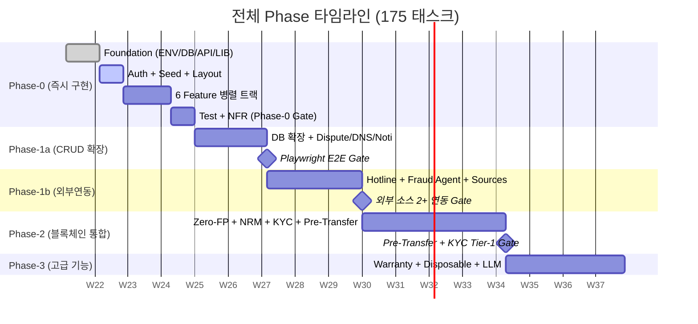
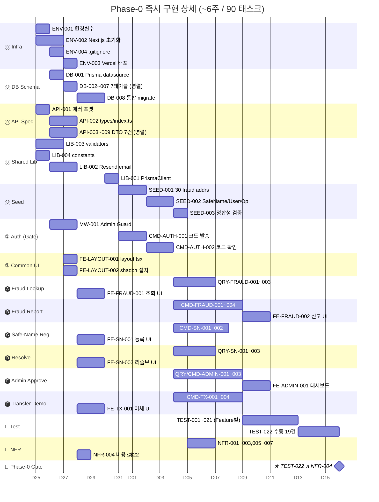
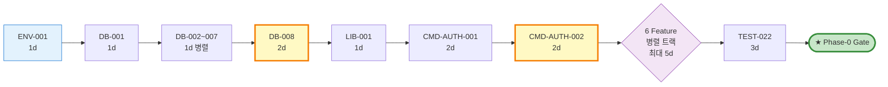
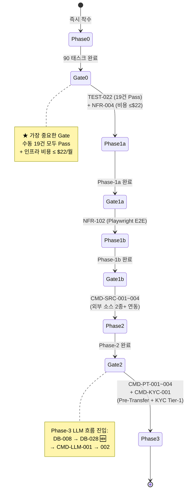
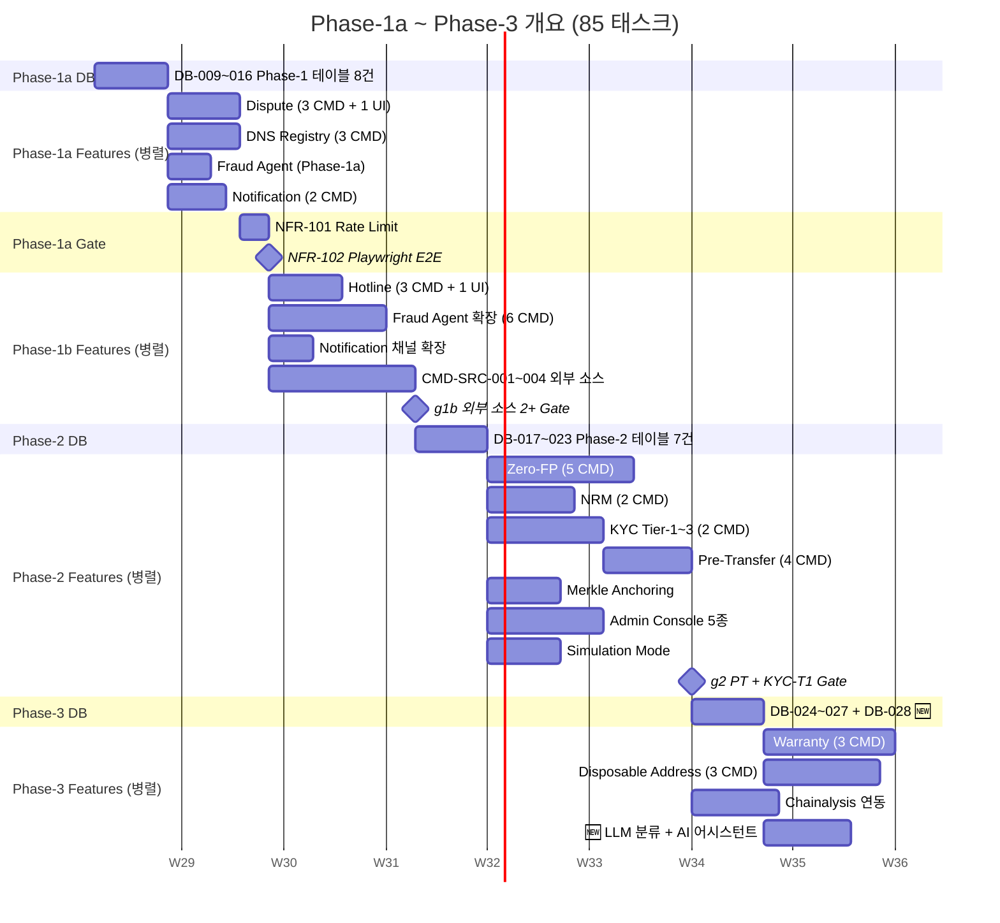
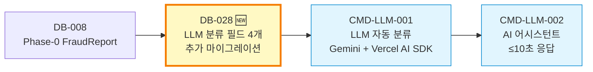

# 프로젝트 간트 차트 (v0.1)

**Source:** `1-2.TASKS_LIST_v0_2_opus47_fn.md` (의존성 맵 §317–368, 175 태스크)
**작성일:** 2026-05-23
**기준:** 간소화된 의존성 다이어그램의 **7개 Layer + 4개 Phase Gate**
**시간 단위:** Week (L=1d, M=2d, H=3d 환산 / 1 Week ≈ 5 영업일, 동일 Layer 내 병렬 처리 가정)

> **읽는 법:** 같은 세로 구간(Week)에 있는 막대는 **동시에 진행 가능**한 작업입니다.
> 의존이 없는 트랙은 좌측부터 일찍 시작 가능하고, 종속이 있는 트랙은 선행 트랙 종료 후 시작됩니다.

---

## 🎯 한눈에 보기 — 전체 6 Phase 흐름 (High-Level)



---

## 🛤️ Phase-0 병렬 트랙 맵 (Swim Lane View) — **가장 중요**

> **핵심 인사이트:** Layer 0~3은 직렬, **Layer 4부터 6개 Feature 트랙이 완전히 독립**적으로 진행 가능합니다.

```
WEEK ▶            W1                    W2                  W3 ─── W4              W5             W6
─────────────────────────────────────────────────────────────────────────────────────────────────────
🟦 INFRA          ENV-001/002/004 ──▶  ENV-003
                   │                  
🟩 DB             ▼ DB-001 ─▶ DB-002~007 ─▶ DB-008 ─────────────────────────────────────────────────
                                                    │
🟧 API SPEC       API-001 ─▶ API-002 ─▶ API-003~009                                                  
                                                    │
🟨 SHARED LIB     LIB-003/004 (독립)               │
                                       LIB-002    LIB-001
                                                    │
🟪 SEED           ────────────────────────────────▶ SEED-001 ─▶ SEED-002 ─▶ SEED-003
                                                    │
🟥 AUTH (Gate)    ──────────────────────────────▶  CMD-AUTH-001 ─▶ CMD-AUTH-002, MW-001
                                                                              │
─────────────────────────────────────────────────  Layer 4 진입 가능 ─────────────────────────────
                                                                              ▼
🅐 FRAUD LOOKUP                                       QRY-FRAUD-001 ─▶ 002 ─▶ 003    ─▶ FE-FRAUD-001
🅑 FRAUD REPORT                                       CMD-FRAUD-001 ─▶ 002 ─▶ 003/004 ─▶ FE-FRAUD-002
🅒 SAFE-NAME REG                                      CMD-SN-001 ─▶ CMD-SN-002         ─▶ FE-SN-001
🅓 RESOLVE                                            QRY-SN-001 ─▶ 002 ─▶ 003          ─▶ FE-SN-002
🅔 ADMIN APPROVE                                      QRY-ADMIN-001 ─▶ CMD-ADMIN-001~003─▶ FE-ADMIN-001
🅕 TRANSFER DEMO                                      CMD-TX-001 ─▶ 002 ─▶ 003 ─▶ 004    ─▶ FE-TX-001
                                                                                            │
🟫 LAYOUT/UI Base FE-LAYOUT-001/002 (W2부터 시작 가능, ENV-002만 필요)                       │
                                                                                            ▼
🧪 TEST                                                       각 Feature → TEST-001~021 ──▶ TEST-022
🔧 NFR                                                                            모든 Handler → NFR-001~007
                                                                                            │
                                                                                            ▼
                                                                              ★ Phase-0 Gate: TEST-022 ∧ NFR-004
```

### 🗝️ 병렬 진행이 가능한 그룹 (= 인력/시간 절약 포인트)

| 그룹 | 동시 진행 가능한 태스크 | 시작 조건 | 비고 |
|---|---|---|---|
| **G1. 즉시 시작** | `ENV-001`, `ENV-002`, `ENV-004`, `API-001`, `LIB-003`, `LIB-004` | None | Day 1부터 6명 동시 작업 가능 |
| **G2. DB 7테이블** | `DB-002`, `DB-003`, `DB-004`, `DB-005`, `DB-006`, `DB-007` | `DB-001` 완료 | 모두 L, 1일 안에 가능 |
| **G3. API DTO 7건** | `API-003` ~ `API-009` | `API-001` 완료 | 모두 L, 1~2일 |
| **G4. 6 Feature 트랙** | 🅐 ~ 🅕 (위 스윔레인 참조) | `CMD-AUTH-002` + `MW-001` 완료 | **최대 6명 병렬, 5~8일 단축 효과** |
| **G5. UI 컴포넌트** | `FE-AUTH-001/002`, `FE-FRAUD-001`, `FE-SN-001/002`, `FE-ADMIN-001`, `FE-TX-001` | `ENV-002`만 필요 → 사실상 G4와 병행 가능 | 디자이너/프론트엔드 별도 인력 활용 |
| **G6. 외부 소스** | `CMD-SRC-001`, `CMD-SRC-004` | `ENV-001`만 필요 (Phase-1b 시작 전 미리) | 사전 PoC 가능 |

---

## 📊 Phase-0 상세 간트 차트 (Mermaid)



---

## ⚡ 크리티컬 패스 (Critical Path) — 가장 긴 의존 사슬



**📐 크리티컬 패스 총 소요시간:** `1 + 1 + 1 + 2 + 1 + 2 + 2 + 5 + 3 ≈ 18 영업일 (~4주)`

> 🔑 **단축 포인트:**
> 1. `DB-002~007` 7개를 1인이 순차 처리하지 말고 1일 내 병렬 처리 (또는 단일 PR로 묶기)
> 2. `LIB-003/004`, `API-001`, `ENV-002`는 **선행 의존 없음** → Day 1부터 분산 착수
> 3. `6 Feature 트랙`은 진짜로 6명에 1트랙씩 분배 가능 → 직렬 처리 시 25일 → 병렬 시 5일

---

## 🚪 Phase Gate 흐름도



---

## 📈 Phase-1a ~ Phase-3 개요 간트



---

## 🆕 Phase-3 LLM 흐름 (v0.2 신규)



> v0.1에서 `CMD-LLM-001`의 선행이 `None`으로 표기되어 있었으나, 분석 결과 **DB 컬럼 추가 마이그레이션이 선행되어야 함**이 식별되어 `DB-028`을 분리·신설.

---

## 📋 진행 시 권장 순서 (Practical Action Plan)

### Week 1 — 6명이 즉시 분담 시작
| 담당 | 작업 |
|---|---|
| Dev A (Infra) | `ENV-001` → `ENV-002` → `ENV-003` → `ENV-004` |
| Dev B (DB) | `DB-001` → `DB-002~007` (1일 병렬 PR) → `DB-008` |
| Dev C (API) | `API-001` → `API-002` → `API-003~009` |
| Dev D (Lib) | `LIB-003`, `LIB-004` (독립) → `LIB-002` → `LIB-001` |
| Dev E (UI base) | `ENV-002` 완료 즉시 `FE-LAYOUT-001`, `FE-LAYOUT-002` |
| Dev F (Spec) | API 응답 케이스 정리, 수동 테스트 시나리오 19건 사전 검토 |

### Week 2 — Auth + Seed 완료, 6 Feature 트랙 분배
| 담당 | Feature 트랙 |
|---|---|
| Dev A | 🅐 Fraud Lookup (Query) — 3 태스크 |
| Dev B | 🅑 Fraud Report (Command) — 4 태스크 |
| Dev C | 🅒 Safe-Name Register — 2 태스크 |
| Dev D | 🅓 Resolve — 3 태스크 |
| Dev E | 🅔 Admin Approval — 4 태스크 |
| Dev F | 🅕 Transfer Demo — 4 태스크 |

### Week 3~4 — Feature 통합 + UI + Test
- 각 Dev가 자신의 Feature UI(`FE-*`) 완성
- 자신의 Feature TEST(`TEST-*`) 작성

### Week 5 — Phase-0 Gate 통과
- `TEST-022` (수동 19건 시나리오)
- `NFR-001~007` 점검
- `NFR-004` 비용 확인

---

## 📦 참고: 태스크 수 분포

| Phase | 태스크 수 | 권장 기간 | 병렬 트랙 수 |
|---|---|---|---|
| Phase-0 | 90 | ~6주 | **최대 6 트랙** |
| Phase-1a | 11 | ~3주 | 4 트랙 |
| Phase-1b | 19 | ~4주 | 4 트랙 |
| Phase-2 | 21 | ~6주 | **최대 7 트랙** |
| Phase-3 | 14 | ~5주 | 4 트랙 |
| NFR 전체 | 15 | (분산) | — |
| **합계** | **175** | **~24주 (직렬 시 ~52주)** | — |

> **병렬화 효과:** 직렬 진행 시 약 52주 → 권장 병렬 진행 시 **24주(~46%)** 단축 추정

---

## 🔗 관련 문서

- **상위 명세:** `1-2.TASKS_LIST_v0_2_opus47_fn.md` (의존성 맵 §317-368)
- **원본 SRS:** `SRS-001 v0.8` (2026-05-16)
- **v0.2 변경 이력:** `4_ISSUES_Qu_V0_2_opus47.md`

---

*본 간트 차트는 의존성 맵의 7개 Layer 구조를 따르며, 동일 Layer 내 태스크는 모두 병렬 진행 가능한 것으로 가정합니다.*
*복잡도(L/M/H)를 1d/2d/3d로 환산하였으며, 실제 일정은 팀 인력 구성에 따라 조정이 필요합니다.*
